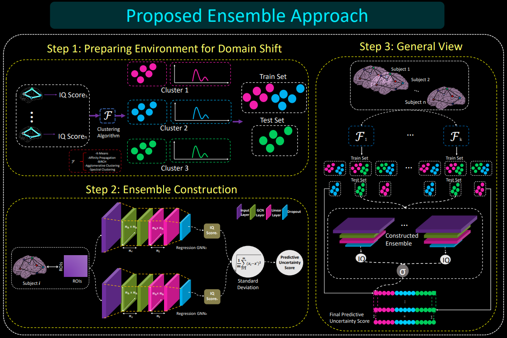

# Predictive Uncertainty Under Target Domain Shift Using Ensemble of GNNs
How to predict uncertainty of regression GNN models under target domain shifts?

Please contact selimmyurekli@gmail.com for inquiries. Thanks. 



# Introduction
This work is accepted at the MICCAI 2022 conference, Singapure.

> **Quantifying the Predictive Uncertainty of Regression
GNN Models Under Target Domain Shifts**
>
> Selim Yürekli, Mehmet Arif Demirtaş and Islem Rekik
>
> BASIRA Lab, Faculty of Computer and Informatics, Istanbul Technical University, Istanbul, Turkey
>
> **Abstract:** Predicting cognitive scores (e.g., intelligence quotient (IQ)) from functional brain connectomes enables the analysis of the underlying connectivity patterns that determine such abilities. In this context, recent works addressed IQ prediction from connectomes by designing graph neural network (GNN) architectures for regression. While effective, existing studies have two important drawbacks. First, the majority of these works train and evaluate regression GNNs on data from the same distribution. Thus, the performance of the models under domain shifts, where the target training and testing behavioral scores are drawn from different distributions, has not been considered. Second, the proposed architectures do not produce uncertainty estimates for their predictions, limiting their usage in critical real-world settings where data distribution may drastically change and render the predictions unreliable. To cope with this, a few studies proposed proposed Bayesian neural networks for estimating predictive uncertainty. However, these require heavy computation of the training process and have not been applied to regression GNNs. To address this problem, we unprecedentedly propose a deep graph ensemble of regression GNNs for estimating predictive uncertainty under domain shifts. Our main contributions are three-fold: (i) forming ensembles of regression GNNs for estimating their predictive uncertainties, (ii) simulating domain shift between training and test sets by applying clustering algorithms in the target domain, (iii) designing a novel metric for quantifying the uncertainty of GNN ensembles. We believe our study will inspire future research on the performance and uncertainty of GNNs under domain shifts, allowing their use in real-world scenarios. 


## Code
This code was implemented using Python 3.8 (Anaconda) on Windows 10.
```diff
 You can edit config.py file to configure the hyperparameters for ensemble and clustering algorithms.
```

## Dependencies

Code was prepared using Python 3.7.10. The major dependencies are listed below, and the full list can be found in ```requirements.txt```:

* torch >= 1.7.0
* torch_scatter >= 2.0.6
* torch_sparse >= 0.6.9
* torch_cluster >= 1.5.9
* torch_spline_conv >= 1.2.1
* torch_geometric >= 1.6.3
* scikit-learn >= 0.24.1
* numpy >= 1.19.5
* pandas >= 1.1.5
* matplotlib
* torchaudio


Please install the above packages using 
```pip install numpy```
```pip install matplotlib```
```pip install pandas```
```pip install scikit-learn```

 command, whereas torch_scatter, torch_sparse, torch_cluster and torch_spline_conv can be installed from using the following commands, as they are not available on PyPI:

```
pip install torch-scatter -f https://pytorch-geometric.com/whl/torch-1.7.0+cu102.html
pip install torch-sparse -f https://pytorch-geometric.com/whl/torch-1.7.0+cu102.html
pip install torch-cluster -f https://pytorch-geometric.com/whl/torch-1.7.0+cu102.html
pip install torch-spline-conv -f https://pytorch-geometric.com/whl/torch-1.7.0+cu102.html
pip install torch-geometric
```

For information on torch_geometric installation, please visit [their website](https://pytorch-geometric.readthedocs.io/en/latest/notes/installation.html).


## Download the ABIDE functional connectome data
You can directly download the functional connectomes at: http://fcon_1000.projects.nitrc.org/fcpClassic/FcpTable.html


## Simulation and Training Process

Please use ```demo.py``` file in order to train and test ensemble with proposed way. Either data can be simulated or real world data can be used by specifiying the argument  ```--data-source``` .

```demo.py``` file can be used to either prepare real data for usage in ensemble by or it can be used to create simulated data using the parameters specified in ```config.py``` file. The script will start training process after simulating brain connectome map with the features in ```config.py``` file.

To start simulating data , use the following command:

```bash
python demo.py --data-source simulate_data
```

To start training under domain shift without simulating data(use real data or already simulated data), use the following command. Please provide real data files with .ts extension to path in config file :

```bash
python demo.py --data-source predict --mode ds
```

To start training under no domain shift(cross validation) without simulating data(use real data or already simulated data), use the following command. Please provide real data files with .ts extension to path in config file :
```bash
python demo.py --data-source predict --mode cv
```

#####  You may edit config.py to tune hyperparameters, configure training or supply your own dataset.


## Ensemble Construction

In order to train an ensemble, please use the ```ensemble.txt``` file. 

To append RegGNN model with specified models to ensemble, line format should be as follows:
```bash
RegGNN/nh/nc/nl/Dropout
```
To append PNANet model with specified models to ensemble, line format should be as follows:
```bash
PNA/nh/nc/nl/Dropout
```

An example ensemble:
```bash
RegGNN/64/0/0/0.3
PNA/64/1/0.3
```

## Configuration Options
Different options for models and data can be specified using ```config.py``` file. The options used throughout the program are as follows:

System options:
- ```DATA_FOLDER```: Data folder that simulation data will be read from and saved to.
- ```RESULT_FOLDER```: Data folder that prediction arrays will be saved to.

Simulated data options:
- ```CONNECTOME_MEAN```:  mean of the distribution from which connectomes will be sampled
- ```CONNECTOME_STD```: std of the distribution from which connectomes will be sampled
- ```SCORE_MEAN```: mean of the distribution from which scores will be sampled
- ```SCORE_STD```: std of the distribution from which scores will be sampled
- ```N_SUBJECTS```: number of subjects in the simulated data
- ```CONNECTOME```: tensor filename of the simulated connectome.
- ```SCORE```: tensor filename of the simulated score.
- ```DATA_SEED```: random seed for data creation
- ```MODEL_SEED ```: random seed for models

PNA options:
- ```SCALERS```: scalers used by PNA
- ```AGGRS```: aggregators used by PNA

EnsembleConstants options:
- ```SEED_LIST ```:  seeds used during shuffling.
- ```ALGO_LIST ```: algorithms used during clustering
- ```CV_FOLD ```: number of Fold in Cross Validation
- ```EPOCH  ```: number of Epoch
- ```DEVICE  ```: Device which training and testing will be on.
- ```LEARNING_RATE  ```: Learning rate for optimizer
- ```WEIGHT_DECAY  ```: Weigt Decay for optimizer

## Code components
| Component | Content |
| ------ | ------ |
| config.py | Includes hyperparameter and other options. You may modify it according to your needs. |
| /RegGNN| Implementation of the RegGNN[1] model. |
| /PNA| Implementation of the PNANet[2] model. |
| demo.py| Driver code that import variables from config.py and trains ensemble with and without domain shift.  |
| ensemble.txt| Definition of base learners in the ensemble. |


## YouTube videos to install and run the code and understand how our code works

To install and run our code, check the following YouTube video: 

https://www.youtube.com/watch?v=GSUQBodRYmA&list=PLug43ldmRSo2p3vVV5K9I4yWZuyXQ0_jL&index=2&ab_channel=BASIRALab

To learn about how our method works, check the following YouTube video: 

https://www.youtube.com/watch?v=F7_dnlJsuMo&list=PLug43ldmRSo0bX8cOSuMWinXs-xem9q4o&index=6&ab_channel=BASIRALab

## Relevant References

[1] Hanik, M., Demirtas¸, M.A., Gharsallaoui, M.A., Rekik, I.: Predicting cognitive scores with graph neural networks through sample selection learning. Brain Imaging and Behavior 16 (2022) 1123–1138

[2] Corso, G., Cavalleri, L., Beaini, D., Lio, P., Veli ` ckovi ˇ c, P.: Principal neighbourhood ag- ´ gregation for graph nets. Advances in Neural Information Processing Systems 33 (2020) 13260–13271


## Please cite the following paper when using DGN
```latex
@inproceedings{yurekli2022quantifying,
  title={Quantifying the Predictive Uncertainty of Regression GNN Models Under Target Domain Shifts},
  author={Y{\"u}rekli, Selim and Demirta{\c{s}}, Mehmet Arif and Rekik, Islem},
  booktitle={International Workshop on PRedictive Intelligence In MEdicine},
  pages={149--159},
  year={2022},
  organization={Springer}
}
```


